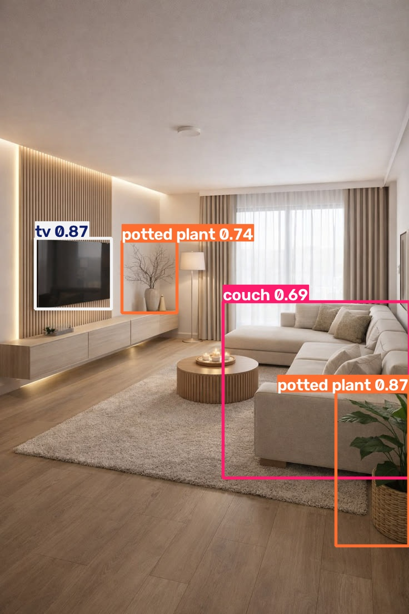
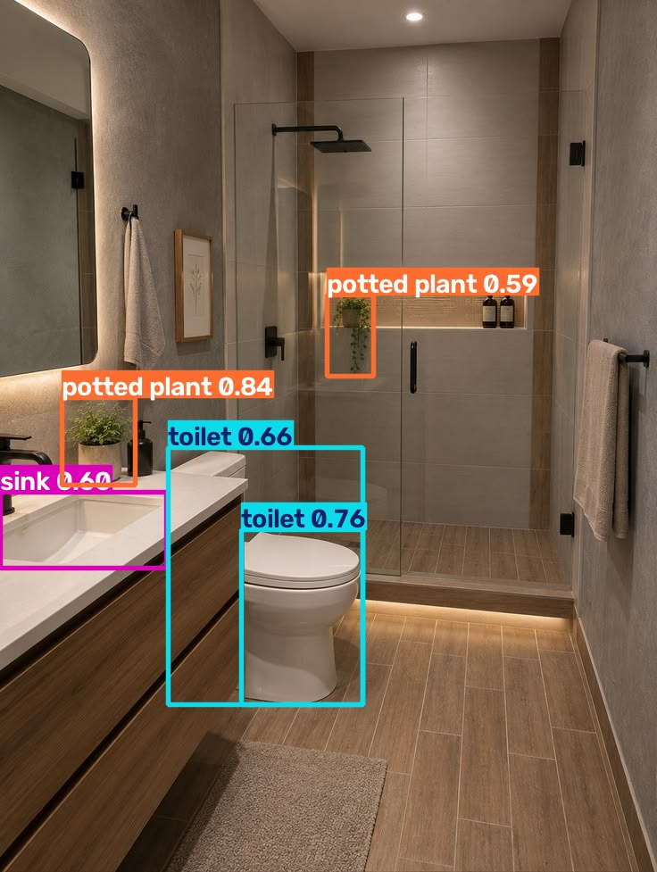
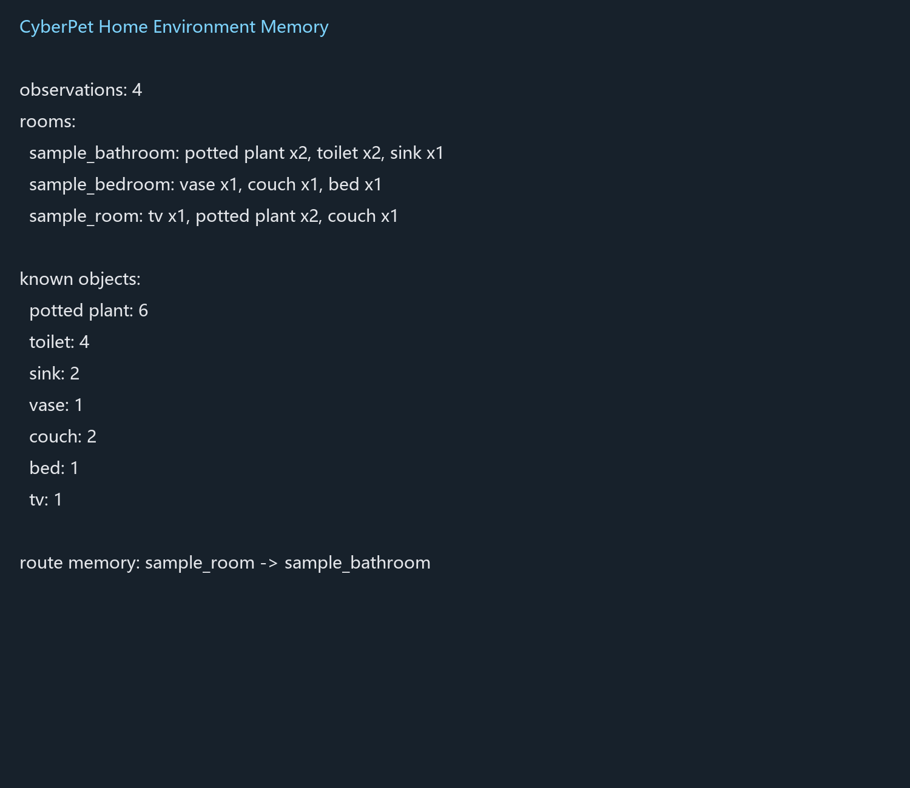
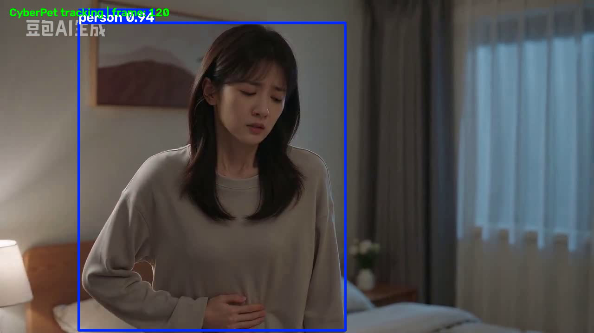
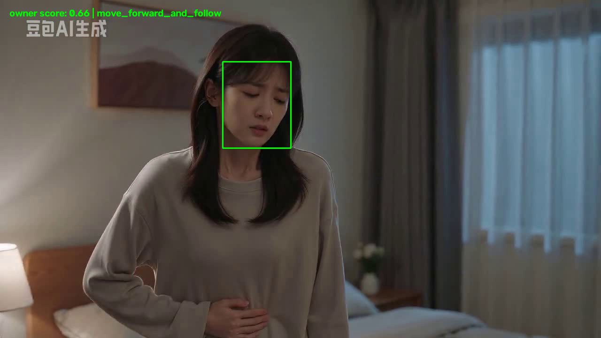

# CyberPet Vision MVP

> 从静态环境识别到动态主人跟随的具身智能最小验证

## 项目简介

本项目围绕一个问题展开：一个赛博宠物能否先通过视觉认识环境、记住环境，再识别主人并对主人的移动作出软件层面的行为反馈？

完整的赛博宠物还需要机器人底盘、导航、语音交互和长期学习。本项目暂不追求一次完成完整系统，而是将想法拆成几个可以独立验证、又能够串联起来的视觉模块。

```text
Task 2：静态环境识别
    -> Task 3：环境记忆、相对深度与行为反馈
    -> Task 4：动态人物检测与轨迹跟踪
    -> Task 5：主人识别与模拟跟随
```

## 与共学营学习内容的关系

项目实践主要受到以下内容启发：

- 具身智能概述：理解智能体需要连接身体、算法和环境，不能只有脱离物理世界的推理。
- 计算机视觉与三维重建：理解机器人不仅要识别物体，还需要逐步获得位置和深度信息。
- 导航与路径规划：理解视觉观察需要进一步服务于空间记忆和行动决策。

本项目使用 YOLOv8 进行物体和人物检测，使用 DPT 单目深度估计补充相对深度，使用 OpenCV YuNet 和 SFace 完成人脸检测与特征匹配。真实机器人动作部分使用模拟驱动接口表示。

## MVP 闭环

```text
图片或视频输入
    -> 视觉感知
    -> 环境/人物信息
    -> 记忆或身份判断
    -> 行为决策
    -> 模拟机器人动作
```

当前闭环可以回答：

1. 家庭图片中有哪些物体？
2. 不同房间中观察到了什么？
3. 物体的相对深度和房间关系如何保存？
4. 视频中的人物是否在连续移动？
5. 当前人物是否匹配注册的主人？
6. 识别到主人后，软件层应该输出什么跟随动作？

## Task 2：静态环境识别

程序自动读取 `images/` 文件夹中的家庭图片，使用 YOLOv8 识别物体，并生成带检测框的结果图和 JSON 环境地图。

本次示例包含卧室和厕所场景，识别过电视、沙发、厕所、洗手池和盆栽等物体。

### 示例结果

将图片放入下面的位置：

```text
assets/task2-room-detection.jpg
assets/task2-bathroom-detection.jpg
```

预留展示位置：





## Task 3：环境记忆与行为反馈

Task 3 在静态识别的基础上增加了三类处理：

- 使用 DPT 单目深度估计，为检测到的物体增加相对深度。
- 将多个房间的检测结果合并为家庭环境记忆。
- 根据记忆中的物体选择模拟行为，例如识别到床时模拟前往附近并问候，识别到厕所或洗手池时模拟后退并提醒注意。

程序还可以保存房间级路径关系，例如：

```text
sample_room -> sample_bathroom
```

### 示例结果

将环境记忆或路径查询截图放入：

```text
assets/task3-memory.png
```



## Task 4：动态人物跟踪

Task 4 将输入从静态图片扩展到连续视频。程序逐帧识别 `person`、`cat` 和 `dog`，通过相邻帧的中心位置匹配保持 `track_id`，并记录目标移动轨迹。

这一步验证的是：赛博宠物不仅知道画面里有什么，还能观察同一个目标正在向哪里移动。

本次视频共处理 241 帧，241 帧完成处理且没有帧级错误，主要轨迹持续 207 帧。人物被遮挡或离开视野时，轨迹可能中断或产生新的 ID，这也是动态跟踪需要继续改进的地方。

### 示例结果

将动态跟踪关键帧截图放入：

```text
assets/task4-tracking.png
```



## Task 5：主人识别与模拟跟随

Task 5 将动态跟踪进一步连接到身份判断和行为输出：

```text
主人注册照片
    -> 人脸特征提取
    -> 视频人脸匹配
    -> 判断主人位置
    -> 输出模拟跟随或停止动作
```

动作规则示例：

| 视觉结果 | 模拟动作 |
| --- | --- |
| 主人在画面左侧 | 向左调整并跟随 |
| 主人在画面右侧 | 向右调整并跟随 |
| 主人在画面中央 | 向前跟随 |
| 距离过近 | 停止并保持安全距离 |
| 未识别到主人 | 停止并等待重新识别 |

本次运行共处理 241 帧，其中 150 帧识别到主人，识别率约为 62.24%；其余帧输出停止等待动作。这个结果说明软件链路已经跑通，但也暴露出遮挡、转身、关门和视角变化对识别的影响。

当前输出的动作是模拟机器人驱动指令，并没有连接真实轮子、扬声器或底盘。

### 示例结果

将主人识别或模拟动作结果截图放入：

```text
assets/task5-owner-follow.png
```



## 代码结构

```text
cyberpet_env_detection/
├── cyberpet_object_detection.py   # 静态物体检测与相对深度
├── task3_home_memory.py           # 环境记忆、路径查询与模拟行为
├── track_dynamic_video.py         # 动态目标检测与轨迹跟踪
├── owner_face_follow_mvp.py       # 主人识别与模拟跟随
├── run.py                         # 静态图片批量检测入口
├── images/                        # 本地家庭图片，不提交
├── videos/                        # 本地视频，不提交
├── owner_images/                  # 本地主人照片，不提交
└── mvp_showcase/                  # 本展示页与脱敏示例图
```

## 运行入口

使用项目的 `embodied_new` Python 环境：

```bash
# 静态图片识别
E:/miniconda3/envs/embodied_new/python.exe run.py

# 环境记忆、路径和行为反馈
E:/miniconda3/envs/embodied_new/python.exe task3_home_memory.py --route sample_room,sample_bathroom --from-room sample_room --to-room sample_bathroom --simulate-behavior

# 动态人物跟踪
E:/miniconda3/envs/embodied_new/python.exe track_dynamic_video.py

# 主人识别与模拟跟随
E:/miniconda3/envs/embodied_new/python.exe owner_face_follow_mvp.py
```

## 当前边界

已经完成的软件层验证：

- 静态家庭物体识别
- 相对深度估计
- 多房间环境记忆
- 房间级路径查询
- 基于物体的模拟行为反馈
- 动态人物检测与轨迹记录
- 主人身份匹配
- 基于主人位置的模拟跟随动作

尚未完成的真实机器人能力：

- 真实底盘和轮子控制
- 真实摄像头长期运行
- 真实米制距离标定
- 遮挡后的可靠身份重识别
- SLAM 统一空间坐标
- 障碍物避让和安全策略

## 总结

这个项目没有直接声称已经完成完整的赛博宠物，而是把一个复杂设想拆解成多个可以验证的最小模块，并将视觉结果逐步连接到记忆、身份判断和行为决策。

目前完成的是一个软件层面的 CyberPet Vision MVP：它能够看见环境、记录环境、观察动态人物、识别主人，并生成下一步模拟动作。
